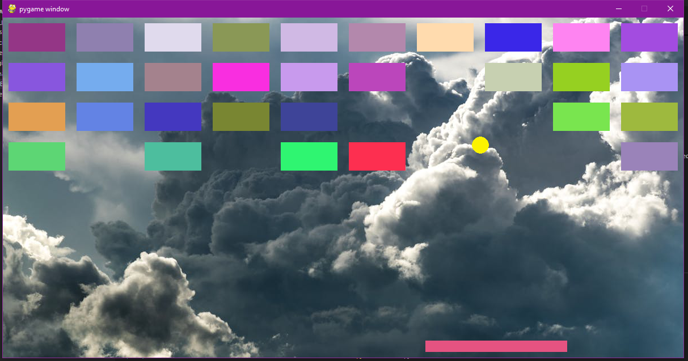

# 🕹️ Breakout Clone Game with Pygame 🎮
Welcome to the Breakout Clone Game! This is a classic brick-breaking game built using Pygame in Python, where you control a paddle to bounce the ball and destroy blocks.

## 🚀 Features
* Responsive Paddle: Move left and right to bounce the ball.
* Dynamic Blocks: Break all the blocks to win the game!
* Challenging Ball Physics: Watch out for the ball's unpredictable bounce!
* Colorful Graphics: Each block has a randomly generated color.
* Game Over and Win Conditions: The game ends when the ball touches the bottom or all blocks are destroyed.

## 🛠️ Installation and Setup
1. Clone this repository:

    ```bash
    git clone https://github.com/kdaniel06/pygame-breakout-clone.git
    cd pygame-breakout-clone
    ```

2. Create a virtual environment and activate it:

    ```bash
    python -m venv venv
    source venv/bin/activate  # On Windows: venv\Scripts\activate
    ```

3. Install the required dependencies:

    ```bash
    pip install pygame
    ```

4. Run the game:

    ```bash
    python main.py
    ```

## 🖼️ Assets
* Make sure to place your game assets (like images) inside the assets folder.
* Currently, the background is set to image.jpg. You can replace it with your own image by placing it in the assets folder.

## 🎮 Controls
* Left Arrow (←): Move paddle left
* Right Arrow (→): Move paddle right

## 🔥 How to Play
* Launch the game.
* Use the paddle to bounce the ball and destroy all blocks.
* If the ball touches the bottom of the screen, it's Game Over!
* Clear all blocks to Win!

## 📖 Based On
This project is heavily inspired by and built following [this breakout game tutorial](https://youtu.be/KDhOEqo0m38?si=b6Hg6z6eZ7UR3zEw), which served as a fantastic guide for this implementation. Check it out if you want to learn more about building games with Pygame!

## 📸 Screenshots


## 🧑‍💻 Author
Developed by Daniel Cascante. Feel free to contribute or report issues!

Enjoy breaking those bricks! 😎
--- 